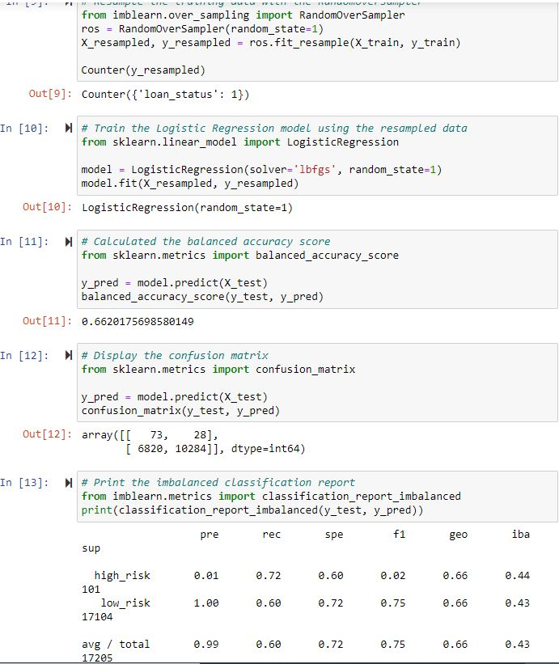
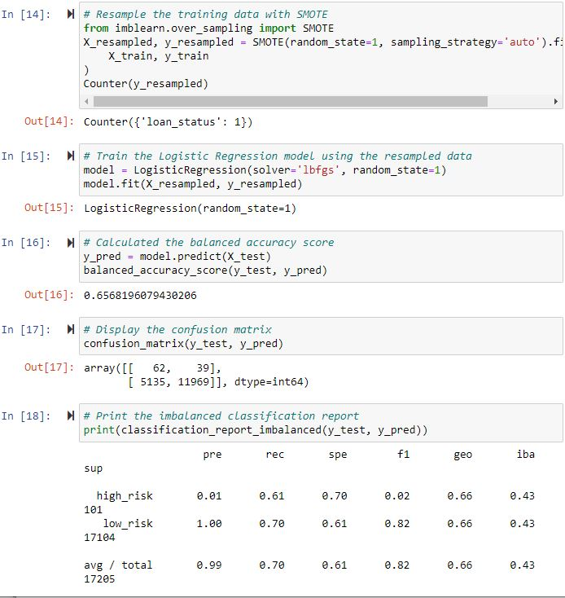
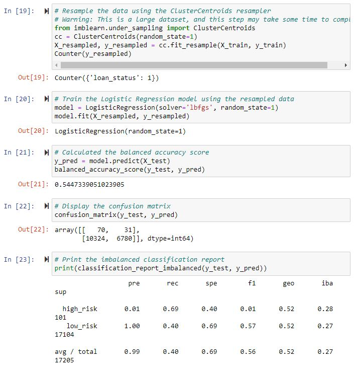
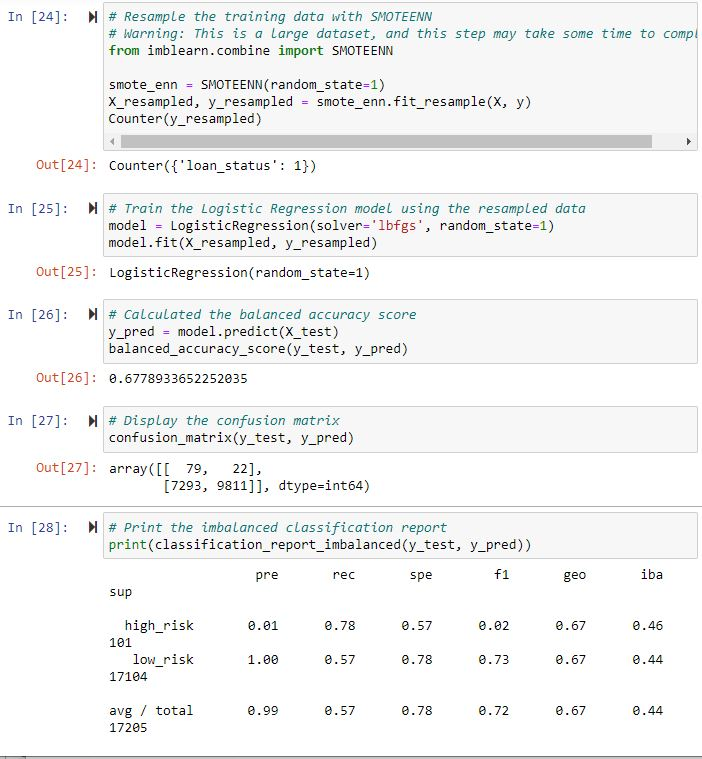
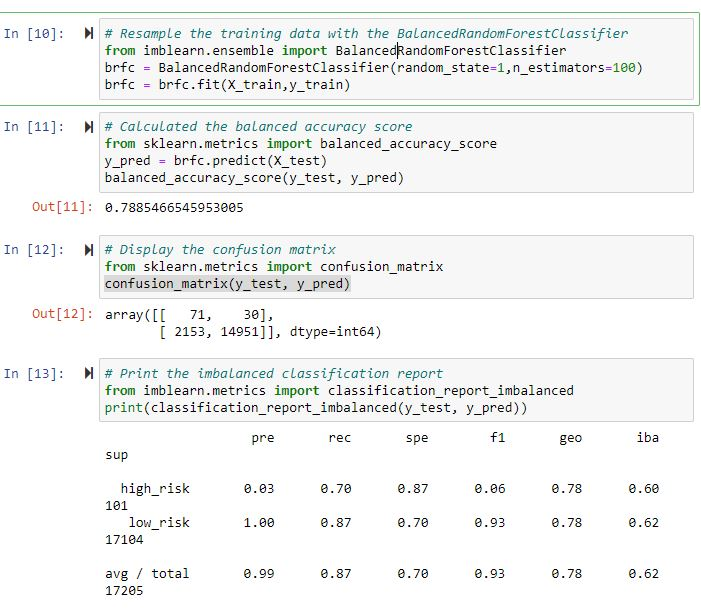
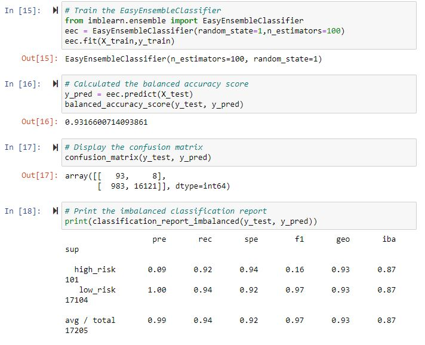

# credit_risk_analysis

## Overview

### Purpose

The purpose of this analysis is to assess which ML model is optimized for assessing credit risk based on data that have been provided.  The models in this analysis have utilized oversampling techniques, undersampling, and combination sampling as well as two ensemble methods for supervised machine learning.  Imbalanced data were provided for fitting that contained 68470 low-risk loans and 347 high-risk loans along with several attributes for each loan that are presumed to be contributing factors to the risk status of the loans.

## Results

* When performing Naive Random Oversampling followed by Logistic Regression, the model yields an accuracy score of 0.66, a precision of 0.01, a recall/sensitivity of 0.72, and an F1 of 0.02 when attempting to identify high-risk loans.

* When performing SMOTE oversampling followed by Logistic Regression, the model yields an accuracy score of 0.66, a precision of 0.01, a recall of 0.61 and an F1 of 0.02 when attempting to identify high-risk loans.

* When performing ClusterCentroids undersampling followed by Logistic Regression, the model yields an accuracy score of 0.55, a precision of 0.01%, a recall/sensitivity of 0.69, and an F1 of 0.01 when attempting to identify high-risk loans.

* When performing SMOTEENN combination sampling followed by Logistic Regression, the model yields an accuracy score of 0.68, a precision of 0.01, a recall/sensitivity of 0.78, and an F1 of 0.02 when attempting to identify high-risk loans.

* When utilizing the BalancedRandomForestClassifier ensemble method, the model yields an accuracy score of 0.79, a precision of 0.01, a recall/sensitivity of 0.70, and an F1 of 0.06 when attempting to identify high-risk loans.

* When utilizing the EasyEnsembleClassifier ensemble method, the model yields an accuracy score of 0.93, a precision of 0.09, a recall/sensitivity of 0.92, and an F1 of 0.16 when attempting to identify high-risk loans.

## Summary

